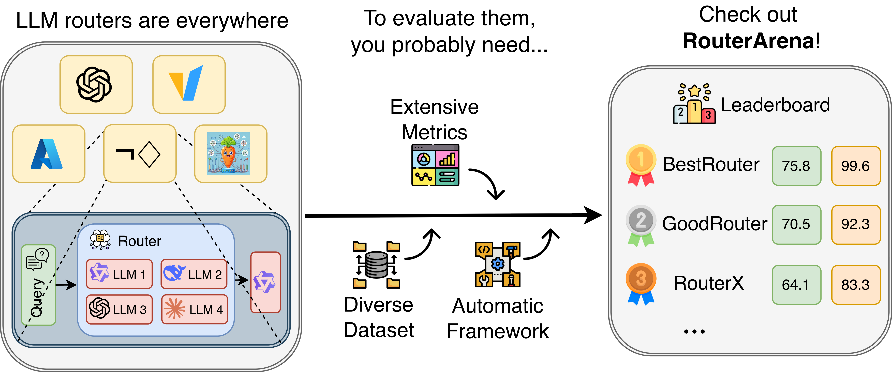

<div align="center">
  

  <br>
  <p>
    <a href="https://huggingface.co/blog/JerryPotter/who-routes-the-routers"></a>
    <a href="https://arxiv.org/abs/2510.00202"></a>
    <a href="https://huggingface.co/datasets/RouteWorks/RouterArena"></a>
    <br>
  </p>

</div>

<h1 align="center"> Make Router Evaluation Open and Standardized </h1>

<p align="center">
  
</p>

**RouterArena** is an open evaluation platform and leaderboard for **LLM routers**—systems that automatically select the best model for a given query. As the LLM ecosystem diversifies with models varying in size, capability, and cost, **routing** has become critical for balancing performance and cost. Yet, LLM routers currently lack a standardized evaluation framework to assess how effectively they trade off accuracy, cost, and other related metrics.

RouterArena bridges this gap by providing an open evaluation platform and benchmarking framework for both open-source and commercial routers. It has the following key features:

- 🌍 **Diverse Data Coverage**: A principly-constructed, diverse evaluation dataset spanning 9 domains and 44 categories with easy, medium, and hard difficulty levels.
- 📊 **Comprehensive Metrics**: Five router-critical metrics measuring accuracy, cost, optimality, robustness, and latency.
- ⚙️ **Automated Evaluation**: An automated evaluation framework to simplify the evaluation process for open-source and commercial routers.
- 🏆 **Live Leaderboard**: A live leaderboard to track the performance of routers across multiple dimensions.

*We aim for RouterArena to serve as a foundation for the community to evaluate, understand, and advance LLM routing systems.*

# Current Leaderboard

For more details, please see our [website](https://routeworks.github.io/leaderboard) and [blog](https://huggingface.co/blog/JerryPotter/who-routes-the-routers).

<div style="overflow-x: auto; white-space: nowrap;">

<table>
  <thead>
    <tr>
      <th>Rank</th>
      <th>Router</th>
      <th>Affiliation</th>
      <th>Arena</th>
      <th>Optimal Selection</th>
      <th>Optimal Cost</th>
      <th>Optimal Accuracy</th>
      <th>Latency</th>
      <th>Robustness</th>
    </tr>
  </thead>
  <tbody>

  <tr>
    <td>🥇</td>
    <td><a href="https://arxiv.org/pdf/2506.01048">MIRT-BERT</a> <a href="https://github.com/Mercidaiha/IRT-Router">[GH]</a></td>
    <td>🎓 USTC</td>
    <td>66.89</td>
    <td>3.44</td>
    <td>19.62</td>
    <td>78.18</td>
    <td>27.03</td>
    <td>94.50</td>
  </tr>

  <tr>
    <td>🥈</td>
    <td><a href="https://ai.azure.com/catalog/models/model-router">Azure-Router</a> <a href="https://learn.microsoft.com/en-us/azure/ai-foundry/openai/concepts/model-router">[Web]</a></td>
    <td>💼 Microsoft</td>
    <td>66.66</td>
    <td>22.52</td>
    <td>46.32</td>
    <td>81.96</td>
    <td>—</td>
    <td>—</td>
  </tr>

  <tr>
    <td>🥉</td>
    <td><a href="https://arxiv.org/pdf/2506.01048">NIRT-BERT</a> <a href="https://github.com/Mercidaiha/IRT-Router">[GH]</a></td>
    <td>🎓 USTC</td>
    <td>66.12</td>
    <td>3.83</td>
    <td>14.04</td>
    <td>77.88</td>
    <td>10.42</td>
    <td>44.50</td>
  </tr>

  <tr>
    <td>4</td>
    <td><a href="https://openai.com/index/introducing-gpt-5/">GPT-5</a></td>
    <td>💼 OpenAI</td>
    <td>64.32</td>
    <td>—</td>
    <td>—</td>
    <td>—</td>
    <td>—</td>
    <td>—</td>
  </tr>

  <tr>
    <td>5</td>
    <td><a href="https://vllm-semantic-router.com/">vLLM-SR</a> <a href="https://github.com/vllm-project/semantic-router">[GH]</a> <a href="https://huggingface.co/llm-semantic-router">[HF]</a></td>
    <td>💼 vLLM</td>
    <td>64.32</td>
    <td>4.79</td>
    <td>12.54</td>
    <td>79.33</td>
    <td>0.19</td>
    <td>100.00</td>
  </tr>

  <tr>
    <td>6</td>
    <td><a href="https://arxiv.org/abs/2502.03261">CARROT</a> <a href="https://github.com/somerstep/CARROT">[GH]</a> <a href="https://huggingface.co/CARROT-LLM-Routing">[HF]</a></td>
    <td>🎓 UMich</td>
    <td>63.87</td>
    <td>2.68</td>
    <td>6.77</td>
    <td>78.63</td>
    <td>1.50</td>
    <td>93.60</td>
  </tr>

  <tr>
    <td>7</td>
    <td><a href="https://huggingface.co/adaptive-classifier/chayan">Chayan</a> <a href="https://huggingface.co/adaptive-classifier/chayan">[HF]</a></td>
    <td>💼 Adaptive Classifier</td>
    <td>63.83</td>
    <td>43.03</td>
    <td>43.75</td>
    <td>88.74</td>
    <td>—</td>
    <td>—</td>
  </tr>

  <tr>
    <td>8</td>
    <td><a href="https://www.notdiamond.ai/">NotDiamond</a></td>
    <td>💼 NotDiamond</td>
    <td>63.00</td>
    <td>1.55</td>
    <td>2.14</td>
    <td>76.81</td>
    <td>—</td>
    <td>—</td>
  </tr>

  <tr>
    <td>9</td>
    <td><a href="https://arxiv.org/pdf/2403.12031">RouterBench-MLP</a> <a href="https://github.com/withmartian/routerbench">[GH]</a> <a href="https://huggingface.co/datasets/withmartian/routerbench">[HF]</a></td>
    <td>🎓 Academic</td>
    <td>57.56</td>
    <td>13.39</td>
    <td>24.45</td>
    <td>83.32</td>
    <td>90.91</td>
    <td>96.90</td>
  </tr>

  <tr>
    <td>10</td>
    <td><a href="https://arxiv.org/abs/2410.03834">GraphRouter</a> <a href="https://github.com/ulab-uiuc/GraphRouter">[GH]</a></td>
    <td>🎓 UIUC</td>
    <td>57.22</td>
    <td>4.73</td>
    <td>38.33</td>
    <td>74.25</td>
    <td>2.70</td>
    <td>97.50</td>
  </tr>

  <tr>
    <td>11</td>
    <td><a href="https://arxiv.org/pdf/2403.12031">RouterBench-KNN</a> <a href="https://github.com/withmartian/routerbench">[GH]</a> <a href="https://huggingface.co/datasets/withmartian/routerbench">[HF]</a></td>
    <td>🎓 Academic</td>
    <td>55.48</td>
    <td>13.09</td>
    <td>25.49</td>
    <td>78.77</td>
    <td>1.33</td>
    <td>51.30</td>
  </tr>

  <tr>
    <td>12</td>
    <td><a href="https://arxiv.org/abs/2406.18665">RouteLLM</a> <a href="https://github.com/lm-sys/RouteLLM">[GH]</a> <a href="https://huggingface.co/routellm">[HF]</a></td>
    <td>🎓 Berkeley</td>
    <td>48.07</td>
    <td>99.72</td>
    <td>99.63</td>
    <td>68.76</td>
    <td>0.40</td>
    <td>99.80</td>
  </tr>

  <tr>
    <td>13</td>
    <td><a href="https://arxiv.org/abs/2409.19886">RouterDC</a> <a href="https://github.com/shuhao02/RouterDC">[GH]</a></td>
    <td>🎓 SUSTech</td>
    <td>33.75</td>
    <td>39.84</td>
    <td>73.00</td>
    <td>49.05</td>
    <td>10.75</td>
    <td>97.60</td>
  </tr>

</tbody>
</table>

</div>

🎓 Academic  💼 Commercial 

<!-- <p align="center">
  
</p> -->

<!-- # Have your router on the leaderboard! -->

# Evaluating Your Router

To use our framework to evaluate your router and get your router on the leaderboard, you can follow the steps below. The evaluation pipelines include two stages as shown in the diagram below. First, you need to generate a prediction file for your router. Then, you can open a Pull Request with your router's prediction file to trigger our automated evaluation workflow.

<p align="center">
  
</p>

## 1. Setup

### Step 1.1: Install uv and RouterArena

```bash
curl -LsSf https://astral.sh/uv/install.sh | sh
cd RouterArena
uv sync
```

### Step 1.2: Download Dataset
Download the dataset from [HF dataset](https://huggingface.co/datasets/RouteWorks/RouterArena).

```bash
uv run python ./scripts/process_datasets/prep_datasets.py
```

### Step 1.3: Set Up API Keys (Optional)

In the project root, copy `.env.example` as `.env` and update the API keys in `.env`. This step is **required only if you use our pipeline for LLM inferences**.

```bash
# Example .env file
OPENAI_API_KEY=<Your-Key>
ANTHROPIC_API_KEY=<Your-Key>
# ...
```

See the [`ModelInference`](./llm_inference/model_inference.py) class for the complete list of supported providers and required environment variables. You can extend that class to support more models, or submit a GitHub issue to request support for new providers.

## 2. Get Routing Decisions

Follow the steps below to obtain your router's model choices for each query. Start with the `sub_10` split (a 10% subset with ground-truth answers) for local testing. Once your setup works, you can evaluate on the `full` dataset (ground-truth answers are hidden) for official leaderboard submission.

### Step 2.1: Prepare Config File

Create a config file in `./router_inference/config/<router_name>.json`. An example config file is included [here](./router_inference/config/your-router.json).

```json
{
  "pipeline_params": {
      "router_name": "your-router",
      "models": [
          "gpt-4o-mini",
          "claude-3-haiku-20240307",
          "gemini-2.0-flash-001"
      ]
  }
}
```

For each model in your config, add an entry with the pricing per million tokens in this format at [`model_cost/cost.json`](./model_cost/cost.json):

```json
{
  "gpt-4o-mini": {
    "input_token_price_per_million": 0.15,
    "output_token_price_per_million": 0.6
  },
}
```

> [!NOTE]
> Ensure all models in your above config files are listed in [`./universal_model_names.py`](./universal_model_names.py). If you add a new model, you must also add the API inference endpoint in [`llm_inference/model_inference.py`](./llm_inference/model_inference.py).

### Step 2.2: Create Your Router Class and Generate Prediction File

Create your own router class by inheriting from `BaseRouter` and implementing the `_get_prediction()` method. See [`router_inference/router/example_router.py`](./router_inference/router/example_router.py) for a complete example.

Then, modify [`router_inference/generate_prediction_file.py`](./router_inference/generate_prediction_file.py#L150) to use your router class:

```python
# Replace ExampleRouter with your router class
from router_inference.router.my_router import MyRouter
router = MyRouter(args.router_name)
```

Finally, generate the prediction file:

```bash
uv run python ./router_inference/generate_prediction_file.py your-router [sub_10|full]
```

> [!NOTE]
> - The `<your-router>` argument must match your config filename (without the `.json` extension). For example, if your config file is `router_inference/config/my-router.json`, use `my-router` as the argument.
> - Your `_get_prediction()` method must return a model name that exists in your config file's `models` list. The base class will automatically validate this.

### Step 2.3: Validate Config and Prediction Files

```bash
uv run python ./router_inference/check_config_prediction_files.py your-router [sub_10|full]
```

This script checks: (1) all model names are valid, (2) prediction file has correct size (809 for `sub_10`, 8400 for `full`), and (3) all entries have valid `global_index`, `prompt`, and `prediction` fields.

## 3. Run LLM Inference

Run the inference script to make API calls for each query using the selected models:

```bash
uv run python ./llm_inference/run.py your-router
```

The script loads your prediction file, makes API calls using the models specified in the `prediction` field, and saves results incrementally. It uses cached results when available and saves progress after each query, so you can safely interrupt and resume. Results are saved to `./cached_results/` for reuse across routers.

## 4. Leaderboard Evaluation via Pull Request

If you want to evaluate your router on the full dataset, you can submit a Pull Request with your prediction file:

1. **Add your files**:
   - `router_inference/config/<router_name>.json` - Your router configuration
   - `router_inference/predictions/<router_name>.json` - Your prediction file with `generated_result` fields populated
2. **Open a Pull Request to `main` branch** - The automated workflow will:
   - Validate your submission
   - Run evaluation on the full dataset
   - Post results as a comment on your PR
   - Update the leaderboard upon approval

## Local Evaluation (sub_10 split)

For local evaluation on the `sub_10` split, run the evaluation script:

```bash
uv run python ./llm_evaluation/run.py your-router sub_10
```

The script evaluates generated answers against ground truth, calculates inference costs, and computes router-level metrics. It skips already-evaluated entries, making it safe to re-run or resume.

## Contributing

We welcome and appreciate contributions and collaborations of any kind.

We use pre-commit to ensure a consistent coding style. You can set it up by

```bash
pip install pre-commit
pre-commit install
```

Before pushing your code, run the following and make sure your code passes all checks.

```bash
pre-commit run --all-files
```

## Contacts

Feel free to contact us for contributions and collaborations.

```
Yifan Lu (yifan.lu@rice.edu)
Jiarong Xing (jxing@rice.edu)
```

## Citation:
If you find our project helpful, please give us a star and cite us by:

```bibtax
@misc{lu2025routerarenaopenplatformcomprehensive,
  title        = {RouterArena: An Open Platform for Comprehensive Comparison of LLM Routers},
  author       = {Yifan Lu and Rixin Liu and Jiayi Yuan and Xingqi Cui and Shenrun Zhang and Hongyi Liu and Jiarong Xing},
  year         = {2025},
  eprint       = {2510.00202},
  archivePrefix= {arXiv},
  primaryClass = {cs.LG},
  url          = {https://arxiv.org/abs/2510.00202}
}
```
